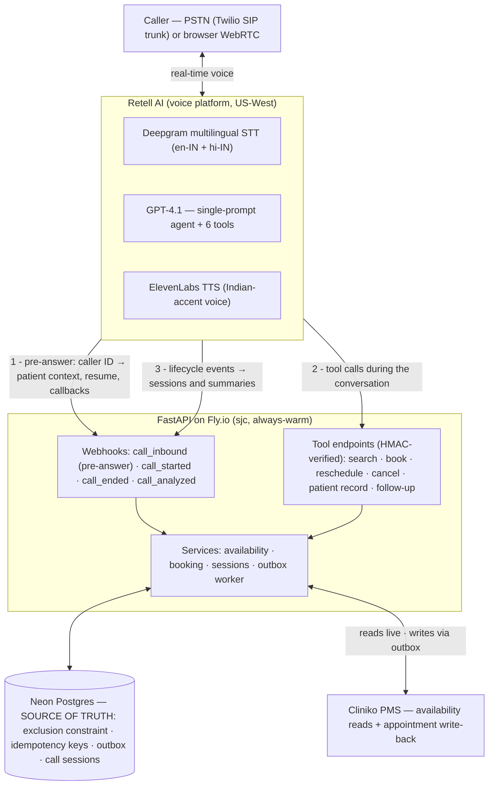
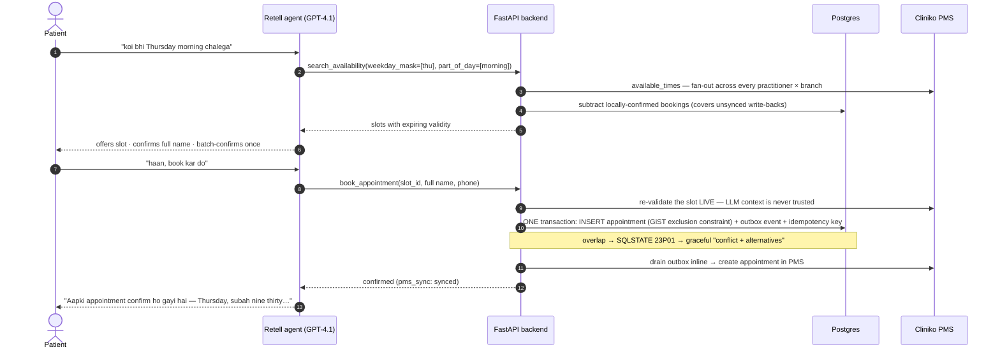
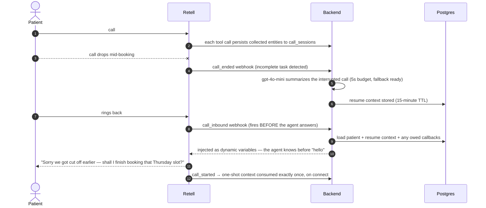

# Clinic Voice Agent — bilingual AI receptionist (English + हिंदी)

A production-style **voice AI receptionist** for a real two-branch physiotherapy clinic in
Bengaluru. Patients call a real phone number (or use a browser call), speak naturally in
English, Hindi, or mixed Hinglish, and book / reschedule / cancel appointments — checked
against live practice-management (Cliniko) availability and enforced by a Postgres backend
that makes double-booking structurally impossible.

**📞 Live demo:** call `+1 (628) 356-4436` · or use the [browser call page](https://clinic-voice-agent.fly.dev/) (no dialing cost, works worldwide)

> The clinic modeled here (branches, practitioners, timings, ₹400 fee) is **real, publicly
> sourced data** from Arogya Physiotherapy's website — see [DISCLAIMER.md](DISCLAIMER.md).
> This is an educational demo, not affiliated with the clinic.

---

## What it handles

- **Full appointment lifecycle** — booking, rescheduling, cancellation, conflict resolution
  with live re-checks and graceful alternatives.
- **English + Hindi with mid-sentence code-switching** — real multilingual ASR/LLM/TTS, no
  translation tables. The agent mirrors the caller's language turn by turn.
- **Fuzzy time understanding** — "any Thursday morning", "Mondays and Wednesdays work",
  "after I get off work, around four thirty", "earliest slot anywhere today" all become
  structured search parameters resolved against live availability.
- **Returning callers** — recognized by caller ID before the first "hello" (pre-answer
  webhook), greeted by name with their upcoming appointments in context.
- **Dropped-call resume** — hang up mid-booking, call back, and the agent acknowledges the
  drop and continues where you left off (15-minute window, consumed exactly once).
- **Missed outbound → callback** — if the clinic's call goes unanswered and the patient
  rings back, the agent knows why the clinic called.
- **Family shared numbers** — two patients on one number: the agent asks *who* first.
- **Cross-branch earliest-slot search** — fans out across every practitioner × branch
  concurrently and answers with the true global earliest.
- **Fee policy honesty** — a ₹100 change fee is mentioned *only* when the change falls
  inside the 24-hour policy window.
- **Escalation** — clinical concerns or "I want a human" produce a logged follow-up ticket
  and an honest "someone will call you back" (never a fake transfer), with no medical advice.
- **Bot-identity honesty**, buffer-time-aware slots, IST-correct dates (no UTC drift),
  spoken-form numbers/times in both languages.

## Stack choice & why

| Layer | Choice | Reasoning |
|---|---|---|
| Voice platform | **Retell AI** | Won on operational surface: pre-answer inbound webhook with per-call dynamic variables (returning-caller recognition), per-component latency telemetry via API (this report's latency data), text-mode Chat API against the same agent brain (powers the eval harness), agent-as-code via API, HMAC-signed webhooks, $10 starter credit. The honest trade-off: US-only servers add ~250–350ms perceived latency for India callers, and Deepgram's Hindi entity recognition is weaker than India-native ASR (Sarvam). Bolna was the runner-up — better Hinglish ASR/TTS via native Sarvam integration — but offers no simulation/testing API (the eval harness would have been fully hand-rolled), a beta API-only flow builder, and its India-hosting advantage applies only to enterprise plans. For a solo rapid build centered on a re-runnable eval harness, Retell's tooling won. |
| LLM | **GPT-4.1** (Retell-hosted, temp 0, high-priority pool) | Strong structured tool-calling at low TTFT; handles Devanagari Hinglish generation natively. |
| STT | **Deepgram multilingual** (`["en-IN","hi-IN"]`, medical vocab) | Only in-platform option with true intra-sentence Hindi/English code-switching. Known limitation: Indian proper nouns ("Bannerghatta") sometimes garble; the LLM recovers from context. |
| TTS | **ElevenLabs "Monika" (en-IN)** | Female Indian-accent voice, natural Devanagari Hindi + English mixing; ~180ms TTFB measured. |
| Telephony | **Twilio US number → Retell via Elastic SIP trunk** | Retell's direct number purchase requires US-ID verification (blocked for Indian individuals); an Indian DID requires business KYC that is impossible in days. A Twilio US number imported over SIP is callable worldwide; the browser call page is the zero-cost fallback. Fully scripted: `python -m scripts.import_twilio_number`. |
| Backend | **FastAPI (async) + Postgres (Neon) on Fly.io** | Deployed in `sjc`, co-located with Retell's US-West infrastructure — tool-call round trips are ~30–80ms, which matters more than caller proximity. Always-warm (`min_machines_running=1`): a cold start mid-call is a fail. |
| PMS | **Cliniko** (30-day trial, 2 businesses = 2 branches) | Real availability engine (working hours, buffers, existing bookings). Its gaps are engineered around — see next section. |

## The backend is the integrity boundary

Cliniko **permits double-bookings, has no webhooks, no idempotency support, and cannot
search patients by phone** — so correctness lives in Postgres:

- **No double-booking, structurally**: appointments carry a `tstzrange` with a GiST
  **exclusion constraint** (`practitioner_id WITH =, during WITH &&`); an overlapping
  confirmed booking is impossible at the database level. Proven by a concurrent-race test.
- **Idempotent tools**: Retell retries failed tool calls; every write derives an idempotency
  key from `(conversation, tool, semantic args)` — platform-generated filler text is
  excluded — and replays return the stored response. Cancels/reschedules target explicit
  `appointment_id`s so "cancel all three" can never collapse into one.
- **Live re-validation**: `book_appointment` re-checks the slot against Cliniko *at write
  time* — LLM context can never confirm a stale slot.
- **Patient overlap guard**: one patient cannot hold two overlapping bookings (prevents
  duplicate re-booking of an existing appointment).
- **Defined PMS-failure behavior**: every write commits locally with a **transactional
  outbox** event queued atomically (no external I/O ever runs inside a database
  transaction), the event is drained inline for an immediate sync, and a background
  worker retries failures with exponential backoff (`FOR UPDATE SKIP LOCKED`). The local
  booking always stands; Cliniko is eventually consistent.
- **Timezone discipline**: storage is UTC, all human-facing computation in `Asia/Kolkata`;
  regression tests cover the classic "today became tomorrow" edges. (Cliniko quirk handled:
  `available_times` interprets dates in account-local time while everything else is UTC.)

## Architecture



Agent config is **code** ([agent/prompt.md](agent/prompt.md) + [agent/tools_schema.py](agent/tools_schema.py)),
pushed via `python -m agent.agent_config sync` with proper draft→publish versioning. The
dashboard is never the source of truth.

### How a booking works (stale-data defense + transactional write)



If step 12 fails (PMS down), the booking still stands — the outbox worker retries with
exponential backoff, and the agent says so honestly (`pms_sync: pending`).

### Dropped-call resume (state survives the disconnect)



## Eval harness

```
make eval        # or: python -m evals.run_evals
pytest tests -q  # DB integrity guarantees
```

Three layers, because transcripts alone lie:

1. **Simulated-patient scenarios** (12, tagged en/hi/hinglish) — a gpt-4o-mini persona
   converses with the **production agent brain** over Retell's Chat API: same prompt, same
   tools, same backend, same database, live Cliniko. Every live-testing failure found during
   development is encoded as a named `regression_*` scenario (cancel-all completeness,
   duplicate-booking guard, fee windows, previous-call denial).
2. **Deterministic verification** — tool-trace assertions (search-before-book ordering,
   slot-ID provenance, distinct cancel IDs) plus **direct database truth checks** (the
   booking exists; all three cancellations really happened). LLM judges never get the final
   word on state.
3. **DeepEval judges** (temp-0 gpt-4o-mini) — `KnowledgeRetentionMetric` for redundant
   questions, `ConversationalGEval` for per-language discipline and scenario rubrics.

Plus a **per-language latency report** aggregated from real phone/web calls (Retell
per-call percentiles), and DB-level pytest proofs (concurrent double-booking race,
idempotent replay, cancel disambiguation, fee boundaries, timezone edges).

Committed results: [evals/results/report.md](evals/results/report.md) (produced with
`python -m evals.run_evals --save-results`; ad-hoc runs write to the gitignored
`evals/out/`). The report ends with an honest **false-confidence section** — text-mode
scenarios bypass ASR/TTS/telephony, simulated users are too cooperative, judges are
biased, latency was measured under no load.

> ⚠️ The eval suite books and cancels **real appointments on the live Cliniko calendar**
> (with synthetic patients, cleaned up afterwards). Don't run it while someone is
> live-testing the phone number — a scenario could transiently occupy a real slot.

## Measured latency

See the committed [eval report](evals/results/report.md) for current per-language numbers
from real calls. Typical figures during development: **e2e p50 ≈ 1.4–1.9s** (Retell-measured;
excludes the caller-side India↔US leg of ~250–350ms), LLM p50 ≈ 0.9–1.2s (the dominant
component; heavy multi-tool turns spike to 3–4s), TTS ≈ 180ms. Latency posture: high-priority
LLM pool, language-matched holding phrases spoken while tools run, backend co-located with
the platform, 30s availability cache with write-time re-validation.

## Reproduce it

Prereqs: Python 3.11, accounts for Retell, OpenAI, Cliniko (trial), Neon, Fly.io, Twilio
(only for the PSTN number).

```bash
git clone https://github.com/amit-badave-04/clinic-voice-agent && cd clinic-voice-agent
conda env create -f environment.yml && conda activate voice-ai-agent   # or: pip install -r requirements.txt -r requirements-dev.txt
cp .env.example .env                      # fill in keys (comments explain each)
alembic upgrade head                      # schema (incl. exclusion constraint)
python -m seed.cliniko_seed               # branches + appointment types in Cliniko
#   → add practitioners in the Cliniko UI (SETUP_CLINIKO.md — API can't create them)
python -m seed.cliniko_seed               # re-run: links practitioner IDs
python -m seed.local_seed                 # demo patients + fee policy
flyctl launch --no-deploy && flyctl secrets set ... && flyctl deploy   # or any always-warm host
python -m agent.agent_config sync         # create/update + publish the Retell agent
python -m scripts.import_twilio_number    # optional: PSTN number via Twilio SIP import
python -m scripts.smoke_cliniko           # sanity: slots per practitioner
make eval                                 # the harness (only needs .env)
```

Useful scripts: `scripts/dump_calls.py` (recent calls + latency), `scripts/dump_transcript.py`,
`scripts/outbound_call.py` (missed-call/callback demo), `scripts/live_call_checklist.md`
(manual scenario checklist).

## Design trade-offs & v2 roadmap

Deliberate v1 scoping decisions, each with its planned v2 upgrade:

- **Identity: caller ID is a routing hint, verification is OTP.** ✅ *Shipped.*
  Returning patients are greeted by name off caller ID (how real front desks work), but
  disclosing or changing an existing appointment requires a six-digit code sent by SMS
  to the number on file (Twilio Verify), entered by keypad or voice — enforced
  server-side in the tool layer (`verification_required` responses; scoped, short-lived
  verified sessions per call; append-only `auth_events` audit trail). New bookings stay
  frictionless. Calls open with an AI + recording disclosure. Demo/eval personas (the
  fictional `+919000000…` numbers) use a fixed dev code since they have no real SIM; the
  free-form web caller-ID field remains a known demo hole until the demo-page hardening
  lands. Deferred: verification for contact-detail changes, DOB knowledge factor.
  Compliance posture: designed to India's DPDP Act 2023 (most operational obligations
  take effect ~May 2027) — proactive AI/recording notice, minimal data (name + phone +
  appointments), OTP-gated disclosure, auditable auth events.
- **Abuse resistance.** ✅ *Shipped* (`scripts/hardening_runbook.md` documents every
  layer). The demo page's free-form caller-ID field is gone: visitors call as an
  allowlisted fictional persona (with a published dev OTP to experience the in-call
  verification flow) or as their own number, proven by SMS OTP before the call is
  minted — which then starts pre-verified. Web-call minting sits behind Cloudflare
  Turnstile (when configured), a per-IP rate limit, a daily call ceiling, and a
  kill switch (`scripts/kill_switch.py`) that stops minting AND unbinds the phone
  number's agent — the only way Retell truly declines PSTN calls. Calls cap at
  15 minutes and hang up after 2 minutes of silence; webhook bodies are size-capped
  before HMAC verification. Documented residual risks: post-usage billing (no
  prepaid stop), no Retell egress-IP allowlist (HMAC is the trust anchor), spoofable
  PSTN caller ID (mitigated by in-call OTP, not call blocking).
- **Alerting & reconciliation.** ✅ *Shipped* (`scripts/ops_runbook.md`). Telegram/Slack
  paging on callback-owed tickets, permanently-failed PMS write-backs, and calendar
  drift; a 30-minute reconcile loop mirrors staff-created Cliniko appointments locally
  (so the no-double-booking constraint sees them), follows staff moves, and tickets —
  never auto-cancels — anything ambiguous. Optional Sentry/UptimeRobot/Healthchecks
  integrations are settings-gated; when the PMS is unreachable mid-call the agent
  presents changes as *reserved, clinic will confirm* rather than confirmed.
- **ASR on Indian proper nouns — layered, not swapped.** Accuracy-first STT mode +
  boosted keywords (branch/locality/practitioner names, plus the caller's own name per
  call) at the platform layer; a deterministic backend gate (Devanagari→Latin
  romanization, name-plausibility check, fuzzy match against the number's own patients)
  plus a spoken read-back protocol guarantee record correctness regardless of ASR.
  Remaining escape hatches (in-platform AssemblyAI trial; gated Sarvam/Mumbai rebuild)
  and the evidence bar for each: `adr/0001-stack-choice.md`.
- **Cross-continent latency (accepted, gated).** Simple turns now run ~1.3–1.7 s e2e
  p50; heavy tool turns ~2.5 s — bounded by the LLM+tool path, not TTS (~175 ms). The
  India-hosted rebuild exists as an explicit go/no-go gate in `adr/0001-stack-choice.md`
  rather than a promise.
- **4 of 6 roster practitioners modeled** — the Cliniko trial caps active practitioners
  at 5 (owner included); both dual-branch doctors are kept so cross-branch search stays
  meaningful. Flip the `enabled` flags in `seed/arogya_data.py` on a paid plan.
- **Text-mode eval blind spots** — declared inside the report itself; scripted real-call
  spot checks (`scripts/live_call_checklist.md`) remain the truth tier. **v2:** automated
  audio-level tests with recorded utterances.
- **One language pair (v2: more).** English/Hindi today; the platform language array and
  the prompt's mirroring rules extend directly to additional languages.
- **Warm transfer during clinic hours.** ✅ *Shipped.* The agent asks the backend
  (`resolve_live_transfer`) before ever offering a transfer — hours, channel, and the
  staff destination are code and config, not prompt text. Approved transfers run
  Retell's warm-transfer flow (hold music, human detection, a private whisper briefing
  the staff member) while the operator's Telegram ping delivers the caller context as
  their phone rings; transfer webhooks drive the escalation ticket through
  started/bridged/completed/failed, and an unanswered leg falls back to the honest
  callback promise. Outside hours or on browser calls: callback, as before.

## Repo map

```
app/        FastAPI: webhooks, tool endpoints, services (availability, booking,
            sessions, outbox, Cliniko client), schema + migrations
agent/      prompt.md · tools_schema.py · agent_config.py (agent-as-code)
seed/       sourced clinic data · Cliniko seeder · local seeder
evals/      scenario harness · judges · latency report · committed reports in results/
tests/      DB integrity proofs (race, idempotency, fees, timezones) + endpoint/unit tests
scripts/    number import · outbound call · call dumps · smoke tests · live checklist
```
