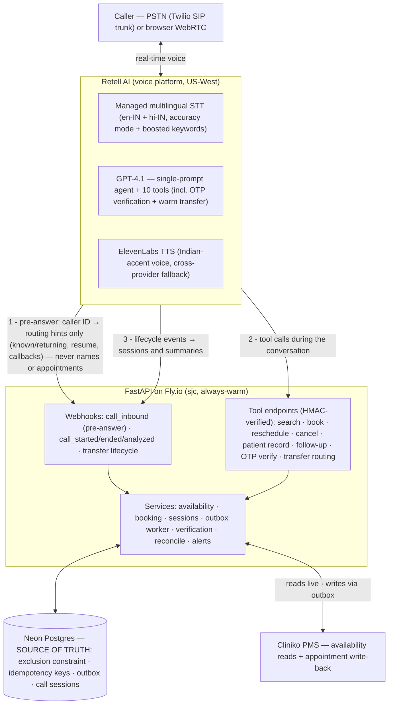
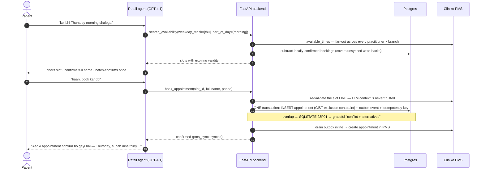
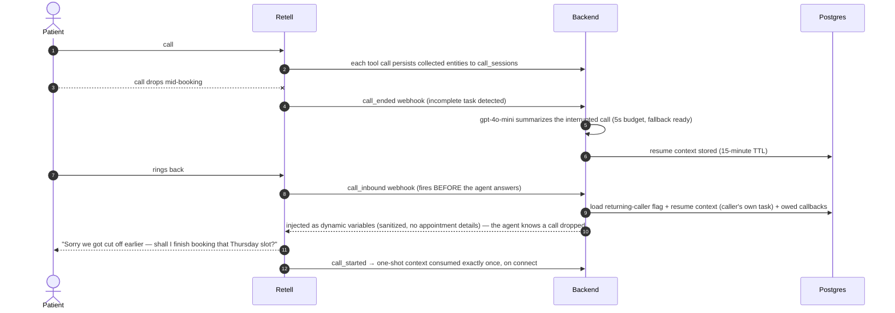

# Clinic Voice Agent — bilingual AI receptionist (English + हिंदी)

A production-style **voice AI receptionist** for a real two-branch physiotherapy clinic in
Bengaluru. Patients call a real phone number (or use a browser call), speak naturally in
English, Hindi, or mixed Hinglish, and book / reschedule / cancel appointments — checked
against live practice-management (Cliniko) availability and enforced by a Postgres backend
that makes double-booking structurally impossible.

**📞 Live demo:** call `+1 (628) 356-4436` · or use the [browser call page](https://clinic-voice-agent.fly.dev/) (no dialing cost, works worldwide)

> The clinic modeled here (branches, practitioners, timings, ₹400 fee) is **real, publicly
> sourced data** from Arogya Physiotherapy's website — see [DISCLAIMER.md](DISCLAIMER.md).
> This is an educational demo, not affiliated with the clinic.

---

## What it handles

- **Full appointment lifecycle** — booking, rescheduling, cancellation, conflict resolution
  with live re-checks and graceful alternatives.
- **English + Hindi with mid-sentence code-switching** — real multilingual ASR/LLM/TTS, no
  translation tables. The agent mirrors the caller's language turn by turn.
- **Fuzzy time understanding** — "any Thursday morning", "Mondays and Wednesdays work",
  "after I get off work, around four thirty", "earliest slot anywhere today" all become
  structured search parameters resolved against live availability.
- **Returning callers** — recognized as a known caller by caller ID before the first
  "hello" (pre-answer webhook) and greeted warmly, but *without* a name or any
  appointment details until identity is verified — caller ID is spoofable, so it is a
  routing hint, never a disclosure key.
- **Dropped-call resume** — hang up mid-booking, call back, and the agent acknowledges the
  drop and continues where you left off (15-minute window, consumed exactly once).
- **Missed outbound → callback** — if the clinic's call goes unanswered and the patient
  rings back, the agent knows why the clinic called.
- **Family shared numbers** — two patients on one number: after the shared number is
  OTP-verified, the specific patient is confirmed by full name **and** date of birth
  before any of their appointments are disclosed or changed (no co-tenant leakage).
- **Cross-branch earliest-slot search** — fans out across every practitioner × branch
  concurrently and answers with the true global earliest.
- **Fee policy honesty** — a ₹100 change fee is mentioned *only* when the change falls
  inside the 24-hour policy window.
- **Verified identity, graded** — caller ID is a routing hint only; the caller's name and
  appointments are never placed in the agent's context from caller ID alone. Hearing or
  changing an existing appointment requires a six-digit SMS OTP to the number on file
  (keypad or voice), after which the record is fetched through the verification-gated tool.
  Enforced server-side with scoped per-call sessions and an append-only auth audit trail;
  shared numbers add a per-patient date-of-birth check. New bookings stay frictionless.
- **Warm transfer during clinic hours** — "I want a human" hands the call to staff with
  hold music, human detection, and a private whisper briefing; the operator's Telegram
  ping carries caller context as their phone rings. Outside hours (or if nobody answers):
  an honest logged callback promise — never a fake transfer. No medical advice, ever.
- **Name integrity for Indian names** — ASR keyword boosting plus a deterministic backend
  gate: Devanagari is romanized before any record write, implausible strings ("Three
  Watch") bounce back for a re-ask, and near-matches of existing patients are confirmed
  instead of silently duplicated.
- **Bot-identity honesty** (calls open with an AI + recording disclosure), buffer-time-aware
  slots, IST-correct dates (no UTC drift), spoken-form numbers/times in both languages.

## Stack choice & why

| Layer | Choice | Reasoning |
|---|---|---|
| Voice platform | **Retell AI** | Won on operational surface: pre-answer inbound webhook with per-call dynamic variables (returning-caller recognition), per-component latency telemetry via API (this report's latency data), text-mode Chat API against the same agent brain (powers the eval harness), agent-as-code via API, HMAC-signed webhooks, $10 starter credit. The honest trade-off: US-only servers add ~250–350ms perceived latency for India callers, and Deepgram's Hindi entity recognition is weaker than India-native ASR (Sarvam). Bolna was the runner-up — better Hinglish ASR/TTS via native Sarvam integration — but offers no simulation/testing API (the eval harness would have been fully hand-rolled), a beta API-only flow builder, and its India-hosting advantage applies only to enterprise plans. For a solo rapid build centered on a re-runnable eval harness, Retell's tooling won. |
| LLM | **GPT-4.1** (Retell-hosted, temp 0, high-priority pool) | Strong structured tool-calling at low TTFT; handles Devanagari Hinglish generation natively. |
| STT | **Retell-managed multilingual, accuracy mode** (`["en-IN","hi-IN"]`, medical vocab, boosted keywords) | True intra-sentence Hindi/English code-switching. Indian proper nouns are the hard case — layered defense: accuracy-first mode + branch/practitioner/caller-name keyword boosting at the platform layer, deterministic name gate in the backend (see `adr/0001-stack-choice.md` for the escape hatches). |
| TTS | **ElevenLabs "Monika" (en-IN)**, cross-provider fallback voice | Female Indian-accent voice, natural Devanagari Hindi + English mixing; ~180ms TTFB measured. A different-provider fallback voice takes over mid-call if the primary TTS degrades. |
| Telephony | **Twilio US number → Retell via Elastic SIP trunk** | Retell's direct number purchase requires US-ID verification (blocked for Indian individuals); an Indian DID requires business KYC that is impossible in days. A Twilio US number imported over SIP is callable worldwide; the browser call page is the zero-cost fallback. Fully scripted: `python -m scripts.import_twilio_number`. |
| Backend | **FastAPI (async) + Postgres (Neon) on Fly.io** | Deployed in `sjc`, co-located with Retell's US-West infrastructure — tool-call round trips are ~30–80ms, which matters more than caller proximity. Always-warm (`min_machines_running=1`): a cold start mid-call is a fail. |
| PMS | **Cliniko** (30-day trial, 2 businesses = 2 branches) | Real availability engine (working hours, buffers, existing bookings). Its gaps are engineered around — see next section. |

## The backend is the integrity boundary

Cliniko **permits double-bookings, has no webhooks, no idempotency support, and cannot
search patients by phone** — so correctness lives in Postgres:

- **No double-booking, structurally**: appointments carry a `tstzrange` with a GiST
  **exclusion constraint** (`practitioner_id WITH =, during WITH &&`); an overlapping
  confirmed booking is impossible at the database level. Proven by a concurrent-race test.
- **Idempotent tools**: Retell retries failed tool calls; every write derives an idempotency
  key from `(conversation, tool, semantic args)` — platform-generated filler text is
  excluded — and replays return the stored response. Cancels/reschedules target explicit
  `appointment_id`s so "cancel all three" can never collapse into one.
- **Live re-validation**: `book_appointment` re-checks the slot against Cliniko *at write
  time* — LLM context can never confirm a stale slot.
- **Patient overlap guard, structurally**: a second GiST exclusion constraint
  (`patient_id WITH =, during WITH &&`) makes it impossible for one patient to hold two
  overlapping confirmed bookings — a race-safe backstop to the application clash check.
- **Defined PMS-failure behavior**: every write commits locally with a **transactional
  outbox** event queued atomically (no external I/O ever runs inside a database
  transaction), the event is drained inline for an immediate sync, and a background
  worker retries failures with exponential backoff (`FOR UPDATE SKIP LOCKED`). The local
  booking always stands; Cliniko is eventually consistent.
- **Timezone discipline**: storage is UTC, all human-facing computation in `Asia/Kolkata`;
  regression tests cover the classic "today became tomorrow" edges. (Cliniko quirk handled:
  `available_times` interprets dates in account-local time while everything else is UTC.)

## Architecture



Agent config is **code** ([agent/prompt.md](agent/prompt.md) + [agent/tools_schema.py](agent/tools_schema.py)),
pushed via `python -m agent.agent_config sync` with proper draft→publish versioning. The
dashboard is never the source of truth.

### How a booking works (stale-data defense + transactional write)



If step 12 fails (PMS down), the booking still stands — the outbox worker retries with
exponential backoff, and the agent says so honestly (`pms_sync: pending`).

### Dropped-call resume (state survives the disconnect)



## Eval harness

```
make eval        # or: python -m evals.run_evals
pytest tests -q  # DB integrity guarantees
```

Three layers, because transcripts alone lie:

1. **Simulated-patient scenarios** (16, tagged en/hi/hinglish) — a gpt-4o-mini persona
   converses with the **production agent brain** over Retell's Chat API: same prompt, same
   tools, same backend, same database, live Cliniko. Every live-testing failure found is
   encoded as a named `regression_*` scenario (cancel-all completeness, duplicate-booking
   guard, fee windows, previous-call denial, Devanagari name storage, implausible-name
   re-ask), plus dedicated OTP-verification scenarios (happy path in Hindi; wrong-code
   must leak nothing and end in a staff callback).
2. **Deterministic verification** — tool-trace assertions (search-before-book ordering,
   slot-ID provenance, distinct cancel IDs) plus **direct database truth checks** (the
   booking exists; all three cancellations really happened). LLM judges never get the final
   word on state.
3. **DeepEval judges** (temp-0 gpt-4o-mini) — `KnowledgeRetentionMetric` for redundant
   questions, `ConversationalGEval` for per-language discipline and scenario rubrics.

Plus a **per-language latency report** aggregated from real phone/web calls (Retell
per-call percentiles), and DB-level pytest proofs (concurrent double-booking race,
idempotent replay, cancel disambiguation, fee boundaries, timezone edges).

Committed results: [evals/results/report.md](evals/results/report.md) (produced with
`python -m evals.run_evals --save-results`; ad-hoc runs write to the gitignored
`evals/out/`). The report ends with an honest **false-confidence section** — text-mode
scenarios bypass ASR/TTS/telephony, simulated users are too cooperative, judges are
biased, latency was measured under no load.

> ⚠️ The eval suite books and cancels **real appointments on the live Cliniko calendar**
> (with synthetic patients, cleaned up afterwards). Don't run it while someone is
> live-testing the phone number — a scenario could transiently occupy a real slot.

## Measured latency

See the committed [eval report](evals/results/report.md) for current per-language numbers
from real calls. Typical figures during development: **e2e p50 ≈ 1.4–1.9s** (Retell-measured;
excludes the caller-side India↔US leg of ~250–350ms), LLM p50 ≈ 0.9–1.2s (the dominant
component; heavy multi-tool turns spike to 3–4s), TTS ≈ 180ms. Latency posture: high-priority
LLM pool, language-matched holding phrases spoken while tools run, backend co-located with
the platform, 30s availability cache with write-time re-validation.

## Reproduce it

Prereqs: Python 3.11, accounts for Retell, OpenAI, Cliniko (trial), Neon, Fly.io, Twilio
(only for the PSTN number).

```bash
git clone https://github.com/amit-badave-04/clinic-voice-agent && cd clinic-voice-agent
conda env create -f environment.yml && conda activate voice-ai-agent   # or: pip install -r requirements.txt -r requirements-dev.txt
cp .env.example .env                      # fill in keys (comments explain each)
#   → set ENVIRONMENT=development for local runs; in production keep it "production"
#     and set TURNSTILE_* keys — the web channel fails closed without them
alembic upgrade head                      # schema (exclusion constraints + patient DOB)
python -m seed.cliniko_seed               # branches + appointment types in Cliniko
#   → add practitioners in the Cliniko UI (SETUP_CLINIKO.md — API can't create them)
python -m seed.cliniko_seed               # re-run: links practitioner IDs
python -m seed.local_seed                 # demo patients (with DOB) + fee policy
flyctl launch --no-deploy && flyctl secrets set ... && flyctl deploy   # or any always-warm host
python -m agent.agent_config sync         # create/update + publish the Retell agent
python -m scripts.import_twilio_number    # optional: PSTN number via Twilio SIP import
python -m scripts.smoke_cliniko           # sanity: slots per practitioner
make eval                                 # the harness (only needs .env)
```

Useful scripts: `scripts/dump_calls.py` (recent calls + latency), `scripts/dump_transcript.py`,
`scripts/outbound_call.py` (missed-call/callback demo), `scripts/live_call_checklist.md`
(manual scenario checklist).

## Production hardening

Beyond the conversation layer, the system carries the operational armor a real
deployment needs — each with its own runbook or decision record:

- **Identity & privacy** — graded disclosure with in-call SMS OTP (Twilio Verify,
  DTMF-first), scoped per-call verified sessions, append-only auth audit. Caller ID is
  treated strictly as a routing hint: names, appointments and prior-call summaries are
  **never** injected into the agent's context pre-verification — they are fetched only
  after OTP through the verification-gated tool — and shared "family line" numbers require
  a per-patient date-of-birth check so one verified co-tenant can't reach another's
  record. The identity gate fails safe (on by default). AI + recording disclosure at call
  open. Designed to India's DPDP Act 2023 (most operational obligations take effect
  ~May 2027).
- **Abuse resistance** ([hardening_runbook](scripts/hardening_runbook.md)) — demo
  identities are allowlisted personas or OTP-proven real numbers (no free-form caller
  ID); web-call minting sits behind Cloudflare Turnstile, which **fails closed in
  production** when unconfigured, plus per-IP rate limits and a daily ceiling; the
  machine-to-machine tool/webhook surface carries its own deterministic budgets
  (per-conversation tool-call limits, per-number mutation limits, and global per-day SMS
  and booking ceilings) so a leaked credential or a steered model loop can't exhaust
  provider quota or spend; a kill switch ([kill_switch.py](scripts/kill_switch.py))
  stops minting *and* unbinds the number's agent — the only way Retell truly declines
  PSTN calls; 15-minute call cap, 2-minute silence hangup, size-capped HMAC-verified
  webhooks.
- **Operations** ([ops_runbook](scripts/ops_runbook.md)) — Telegram/Slack paging on
  callback-owed tickets, permanently-failed PMS write-backs, and calendar drift; a
  30-minute reconcile loop mirrors staff-created Cliniko appointments into the local
  integrity layer, follows staff moves, and tickets (never auto-cancels) anything
  ambiguous; PMS-down bookings are presented as *reserved, clinic will confirm* —
  never a false "confirmed"; structured post-call QA fields with a flagged-call digest
  ([qa_review.py](scripts/qa_review.py)); optional Sentry/UptimeRobot/Healthchecks,
  all settings-gated.
- **Stack decisions with evidence** — why Retell over a rebuild, why GPT-4.1 stays,
  the layered ASR strategy and its escape hatches, and the explicit go/no-go gate for
  an India-hosted Sarvam prototype: [adr/0001-stack-choice.md](adr/0001-stack-choice.md).

## Known limits (deliberate)

- **4 of 6 roster practitioners modeled** — the Cliniko trial caps active practitioners
  at 5 (owner included); both dual-branch doctors are kept so cross-branch search stays
  meaningful. Flip the `enabled` flags in `seed/arogya_data.py` on a paid plan.
- **Text-mode eval blind spots** — scenarios bypass ASR/TTS/telephony (declared inside
  the report itself); scripted real-call spot checks
  (`scripts/live_call_checklist.md`) remain the truth tier. Automated audio-level
  regression tests (recorded utterances, barge-in injection) are designed but deferred.
- **English + Hindi only** — the language array and mirroring rules extend to more, but
  a third language ships only when it can meet the same entity-accuracy bar (assessed
  for Kannada; deferred).
- **Cross-continent latency, accepted and gated** — simple turns ~1.3–1.7 s e2e p50,
  heavy tool turns ~2.5 s, bounded by the LLM+tool path, not TTS (~175 ms); callers in
  India add ~250–350 ms of network. The India-hosted rebuild is an evidence-gated
  option in the ADR, not a promise.
- **Demo personas use a published dev OTP** — they are fictional patients with no SIM;
  the visible code is what lets visitors experience the verification flow. Real numbers
  always get real SMS.

## Repo map

```
app/        FastAPI: webhooks, tool endpoints, services (availability, booking, sessions,
            outbox, Cliniko client, verification, names, transfer, reconcile, alerts,
            guard), schema + migrations
agent/      prompt.md · tools_schema.py · agent_config.py (agent-as-code)
adr/        architecture decision records (stack choice, evidence, go/no-go gates)
seed/       sourced clinic data · Cliniko seeder · local seeder
evals/      scenario harness · judges · latency report · committed reports in results/
tests/      DB integrity proofs (race, idempotency, fees, timezones) + verification,
            guard, transfer-window, name-gate, reconcile and security-regression tests
scripts/    number import · outbound call · call dumps · smoke tests · live checklist ·
            runbooks (rotation, hardening, ops) · kill switch · QA review · Fly secrets
security/   adversarial security review · coverage ledger · remediation log
```
